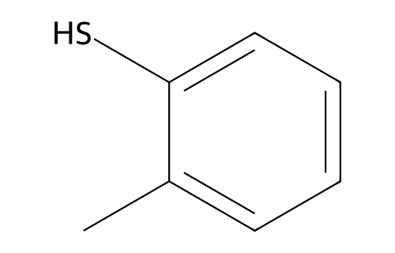
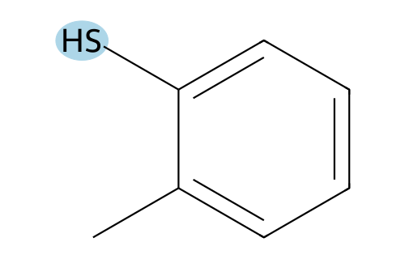
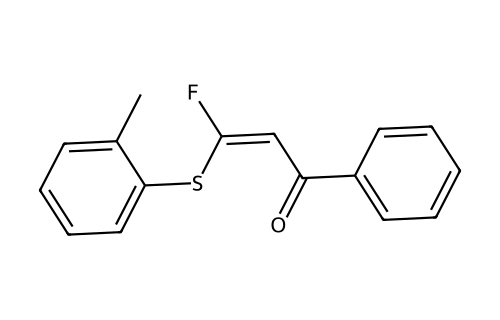

# C011 · 2-Methylbenzenethiol

[← C010](C010.md) · [100-molecule catalog](README.md) · [C012 →](C012.md)

| Recommended-input property | Value |
| --- | --- |
| Molecular formula | C7H8S |
| Canonical SMILES | `Cc1ccccc1S` |
| Proposed bond-forming centre | S |
| Precursor family | aryl_thiol (RF33) |
| Feasibility class | A |
| Novelty review priority | 2 |
| NP labels | unresolved |
| NR labels | unresolved |
| Site/pathway hypotheses | 1 |
| Proposed product options | 1 |

## Recommendation rationale

This aryl_thiol; neutral X-H donor belongs to the aryl_thiol family and was retained as a S-centred recommendation. It is assigned feasibility class A and novelty review priority 2. These categories organize chemical review and do not state that the target reaction has already been demonstrated.

The machine-readable record retains the source-linked activation question, competing pathways, diagnostic observation and transfer limits used in the recommendation workflow.

## Reactive-site hypotheses and proposed endpoints

### C011-H01

Reacting-atom index: **7** (zero-based in `Cc1ccccc1S`).

Proposed route: S-centred substitution; carbonyl retained; one fluorine retained at the new alkene

Evidence basis: RP-guided chemical proposal. Full activation, competing-pathway and diagnostic fields are retained in the hypothesis JSON.

#### C011-H01-O01

`Cc1ccccc1SC(F)=CC(=O)c1ccccc1`

NP **unresolved**; NR **unresolved**. This is a proposed connectivity, not an observed product assignment.

## Relationship to the experimental collection

Best relationship: **Same scaffold, substituent or positional variation**.

| Experimental record | Relationship | Structural basis |
| --- | --- | --- |
| [AP098](experiment_mapping/pairs/AP098.md) | Same scaffold, substituent or positional variation | The reacting-atom type and core scaffold are retained, while substitution or position differs. |
| [AP095](experiment_mapping/pairs/AP095.md) | Same scaffold, substituent or positional variation | The reacting-atom type and core scaffold are retained, while substitution or position differs. |
| [AP097](experiment_mapping/pairs/AP097.md) | Same scaffold, substituent or positional variation | The reacting-atom type and core scaffold are retained, while substitution or position differs. |

## Evidence and data links

RP focus: [RP2](../evidence/principles/RP2.md), [RP3](../evidence/principles/RP3.md). Literature sources: [L010](../literature/sources/L010.md), [L339](../literature/sources/L339.md), [L353](../literature/sources/L353.md), [L354](../literature/sources/L354.md).

[Candidate JSON](data/candidates_100.json) · [103 hypotheses](data/hypotheses_103.json) · [103 product options](product_options/product_options_103.json) · [108 experimental pairs](experiment_mapping/mapping_108.json)
