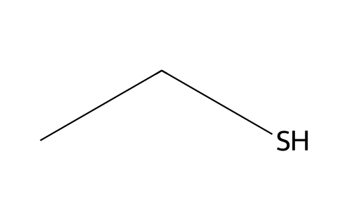
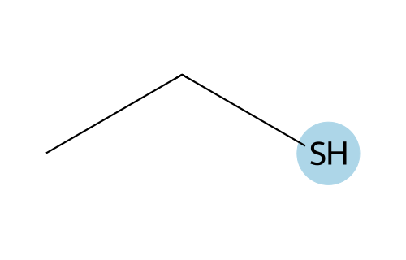
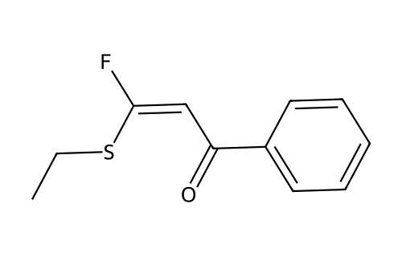

# C022 · Ethanethiol

[← C021](C021.md) · [100-molecule catalog](README.md) · [C023 →](C023.md)

| Recommended-input property | Value |
| --- | --- |
| Molecular formula | C2H6S |
| Canonical SMILES | `CCS` |
| Proposed bond-forming centre | S |
| Precursor family | primary_alkyl_thiol (RF41) |
| Feasibility class | A |
| Novelty review priority | 3 |
| NP labels | 2 |
| NR labels | 2 |
| Site/pathway hypotheses | 1 |
| Proposed product options | 1 |

## Recommendation rationale

This primary_alkyl_thiol; neutral X-H donor belongs to the primary_alkyl_thiol family and was retained as a S-centred recommendation. It is assigned feasibility class A and novelty review priority 3. These categories organize chemical review and do not state that the target reaction has already been demonstrated.

The machine-readable record retains the source-linked activation question, competing pathways, diagnostic observation and transfer limits used in the recommendation workflow.

## Reactive-site hypotheses and proposed endpoints

### C022-H01

Reacting-atom index: **2** (zero-based in `CCS`).

Proposed route: S-centred substitution; carbonyl retained; one fluorine retained at the new alkene

Evidence basis: RP-guided chemical proposal. Full activation, competing-pathway and diagnostic fields are retained in the hypothesis JSON.

#### C022-H01-O01

`CCSC(F)=CC(=O)c1ccccc1`

NP **2**; NR **2**. This is a proposed connectivity, not an observed product assignment.

## Relationship to the experimental collection

Best relationship: **Same donor family, different scaffold**.

| Experimental record | Relationship | Structural basis |
| --- | --- | --- |
| [AP106](experiment_mapping/pairs/AP106.md) | Same donor family, different scaffold | The local donor type is retained, but the molecular scaffold differs. |
| [AP094](experiment_mapping/pairs/AP094.md) | Same donor family, different scaffold | The local donor type is retained, but the molecular scaffold differs. |
| [AP099](experiment_mapping/pairs/AP099.md) | Same donor family, different scaffold | The local donor type is retained, but the molecular scaffold differs. |

## Evidence and data links

RP focus: [RP2](../evidence/principles/RP2.md), [RP3](../evidence/principles/RP3.md). Literature sources: [L353](../literature/sources/L353.md), [L354](../literature/sources/L354.md).

[Candidate JSON](data/candidates_100.json) · [103 hypotheses](data/hypotheses_103.json) · [103 product options](product_options/product_options_103.json) · [108 experimental pairs](experiment_mapping/mapping_108.json)
