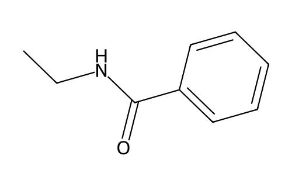
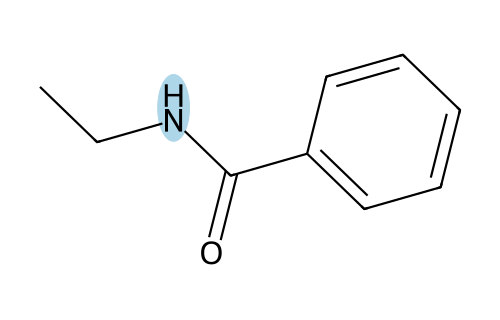
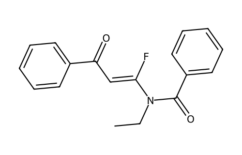

# C068 · N-Ethylbenzamide

[← C067](C067.md) · [100-molecule catalog](README.md) · [C069 →](C069.md)

| Recommended-input property | Value |
| --- | --- |
| Molecular formula | C9H11NO |
| Canonical SMILES | `CCNC(=O)c1ccccc1` |
| Proposed bond-forming centre | N |
| Precursor family | amide (RF01) |
| Feasibility class | B |
| Novelty review priority | 2 |
| NP labels | unresolved |
| NR labels | unresolved |
| Site/pathway hypotheses | 1 |
| Proposed product options | 1 |

## Recommendation rationale

This amide; neutral X-H donor belongs to the amide family and was retained as a N-centred recommendation. It is assigned feasibility class B and novelty review priority 2. These categories organize chemical review and do not state that the target reaction has already been demonstrated.

The machine-readable record retains the source-linked activation question, competing pathways, diagnostic observation and transfer limits used in the recommendation workflow.

## Reactive-site hypotheses and proposed endpoints

### C068-H01

Reacting-atom index: **2** (zero-based in `CCNC(=O)c1ccccc1`).

Proposed route: N-centred substitution; carbonyl retained; one fluorine retained at the new alkene

Evidence basis: RP-guided chemical proposal. Full activation, competing-pathway and diagnostic fields are retained in the hypothesis JSON.

#### C068-H01-O01

`CCN(C(=O)c1ccccc1)C(F)=CC(=O)c1ccccc1`

NP **unresolved**; NR **unresolved**. This is a proposed connectivity, not an observed product assignment.

## Relationship to the experimental collection

Best relationship: **Same scaffold, substituent or positional variation**.

| Experimental record | Relationship | Structural basis |
| --- | --- | --- |
| [AP013](experiment_mapping/pairs/AP013.md) | Same scaffold, substituent or positional variation | The reacting-atom type and core scaffold are retained, while substitution or position differs. |
| [AP008](experiment_mapping/pairs/AP008.md) | Same donor family, different scaffold | The local donor type is retained, but the molecular scaffold differs. |
| [AP029](experiment_mapping/pairs/AP029.md) | Same donor family, different scaffold | The local donor type is retained, but the molecular scaffold differs. |

## Evidence and data links

RP focus: [RP2](../evidence/principles/RP2.md), [RP4](../evidence/principles/RP4.md). Literature sources: [L351](../literature/sources/L351.md).

[Candidate JSON](data/candidates_100.json) · [103 hypotheses](data/hypotheses_103.json) · [103 product options](product_options/product_options_103.json) · [112 experimental pairs](experiment_mapping/mapping_112.json)
