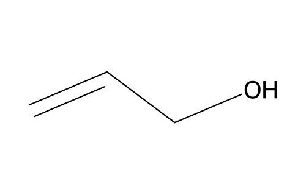
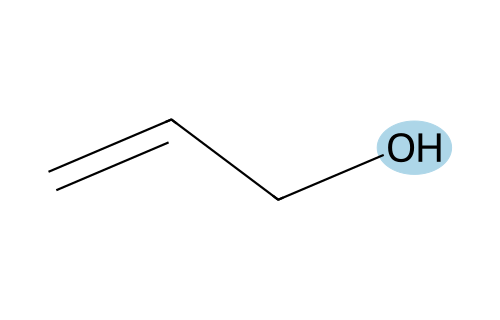
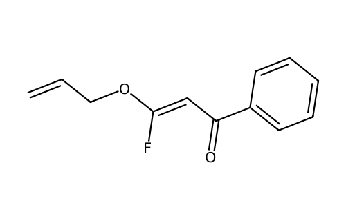

# C095 · Prop-2-en-1-ol

[← C094](C094.md) · [100-molecule catalog](README.md) · [C096 →](C096.md)

| Recommended-input property | Value |
| --- | --- |
| Molecular formula | C3H6O |
| Canonical SMILES | `C=CCO` |
| Proposed bond-forming centre | O |
| Precursor family | allylic_alcohol (RF16) |
| Feasibility class | B |
| Novelty review priority | 3 |
| NP labels | 2 |
| NR labels | 2 |
| Site/pathway hypotheses | 1 |
| Proposed product options | 1 |

## Recommendation rationale

This allylic_alcohol; neutral X-H donor belongs to the allylic_alcohol family and was retained as a O-centred recommendation. It is assigned feasibility class B and novelty review priority 3. These categories organize chemical review and do not state that the target reaction has already been demonstrated.

The machine-readable record retains the source-linked activation question, competing pathways, diagnostic observation and transfer limits used in the recommendation workflow.

## Reactive-site hypotheses and proposed endpoints

### C095-H01

Reacting-atom index: **3** (zero-based in `C=CCO`).

Proposed route: O-centred substitution; carbonyl retained; one fluorine retained at the new alkene

Evidence basis: RP-guided chemical proposal. Full activation, competing-pathway and diagnostic fields are retained in the hypothesis JSON.

#### C095-H01-O01

`C=CCOC(F)=CC(=O)c1ccccc1`

NP **2**; NR **2**. This is a proposed connectivity, not an observed product assignment.

## Relationship to the experimental collection

Best relationship: **Same donor family, different scaffold**.

| Experimental record | Relationship | Structural basis |
| --- | --- | --- |
| [AP054](experiment_mapping/pairs/AP054.md) | Same donor family, different scaffold | The local donor type is retained, but the molecular scaffold differs. |
| [AP075](experiment_mapping/pairs/AP075.md) | Same donor family, different scaffold | The local donor type is retained, but the molecular scaffold differs. |
| [AP066](experiment_mapping/pairs/AP066.md) | Same donor family, different scaffold | The local donor type is retained, but the molecular scaffold differs. |

## Evidence and data links

RP focus: [RP2](../evidence/principles/RP2.md), [RP4](../evidence/principles/RP4.md). Literature sources: [L294](../literature/sources/L294.md), [L328](../literature/sources/L328.md).

[Candidate JSON](data/candidates_100.json) · [103 hypotheses](data/hypotheses_103.json) · [103 product options](product_options/product_options_103.json) · [108 experimental pairs](experiment_mapping/mapping_108.json)
